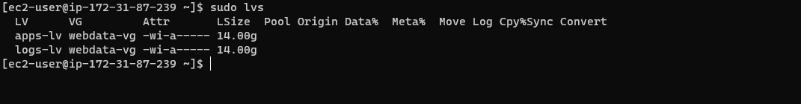
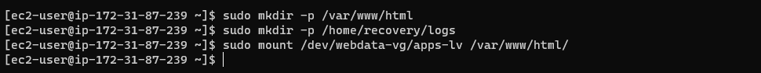
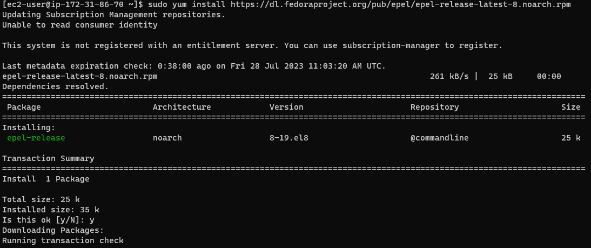
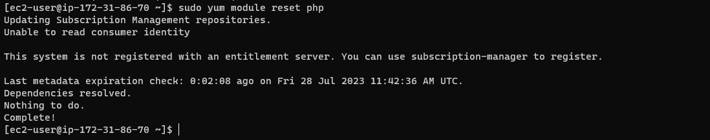

 # Project 6:  Web Solution with Wordpress

 ### Step 1: Prepare a Web Server.
 1. Since, I would be needing 2 instances for this project, I launched 2 ec2 instances (RedHat) to serve as a web server and database, see the result below. 

Note: I will be running the same commands from step 1 to 11 on the 2 instances simultanueously after which I will start running them separetly from setop 12.

2. Created 3 volumes each in the same AZ for my Web Server and database EC2, each of 10 GiB. Attach all three volumes one by one to your Web Server EC2 instance  and the remaining 3 to the database server.

3. Open up the Linux terminal to begin configuration. Run `lsblk` command to inspect what block devices are attached to the server.Their names are xvdf, xvdh, xvdg.

To inspact that all devices in Linux reside in /dev/ directory, run `ls /dev/`

4. Use `df -h` command to see all mounts and free space on your server.

5. Use gdisk utility to create a single partition on each of the 3 disks, run `sudo gdisk /dev/xvdf` `sudo gdisk /dev/xvdg` `sudo gdisk /dev/xvdh`

6. Use lsblk utility to view the newly configured partition on each of the 3 disks. 

7. Install lvm2 package using `sudo yum install lvm2` 

Run `sudo lvmdiskscan` command to check for available partitions.

8. Use pvcreate utility to mark each of 3 disks as physical volumes (PVs) to be used by LVM.
Run `sudo pvcreate /dev/xvdf1` `sudo pvcreate /dev/xvdg1` `sudo pvcreate /dev/xvdh1`

9. Verify that your Physical volume has been created successfully by running `sudo pvs`

10. Use vgcreate utility to add all 3 PVs to a volume group (VG). Name the VG webdata-vg. `sudo vgcreate webdata-vg /dev/xvdh1 /dev/xvdg1 /dev/xvdf1`

11. Verify that your VG has been created successfully by running `sudo vgs`

Note that after this step 11 i will focus only on wesbserver untill i indicate otherwise.

12. Use lvcreate utility to create 2 logical volumes. apps-lv (Use half of the PV size), and logs-lv Use the remaining space of the PV size. `sudo lvcreate -n apps-lv -L 14G webdata-vg`    `sudo lvcreate -n logs-lv -L 14G webdata-vg`

13. Verify that your Logical Volume has been created successfully by running `sudo lvs`

14. Verify the entire setup `sudo vgdisplay -v` #view complete setup - VG, PV, and LV

Run `sudo lsblk`

15. Use mkfs.ext4 to format the logical volumes with ext4 filesystem. Run `sudo mkfs -t ext4 /dev/webdata-vg/apps-lv` `sudo mkfs -t ext4 /dev/webdata-vg/logs-lv`

16. Create /var/www/html directory to store website files `sudo mkdir -p /var/www/html` see output below step 18.

17. Create /home/recovery/logs to store backup of log data `sudo mkdir -p /home/recovery/logs` see output below step 18.

18. Mount /var/www/html on apps-lv logical volume `sudo mount /dev/webdata-vg/apps-lv /var/www/html/`

19. Use rsync utility to backup all the files in the log directory /var/log into /home/recovery/logs (This is required before mounting the file system) `sudo rsync -av /var/log/. /home/recovery/logs/` 

20. Mount /var/log on logs-lv logical volume. (Note that all the existing data on /var/log will be deleted. That is why step 16 above is very important) `sudo mount /dev/webdata-vg/logs-lv /var/log`

21. Restore log files back into /var/log directory `sudo rsync -av /home/recovery/logs/log/. /var/log`

22. Run `sudo blkid` to get UUID of the device which will be used to update the /etc/fstab file. 
Note: Update /etc/fstab file so that the mount configuration will persist after restart of the server.

Edit the /etc/fstab file using `sudo vi /etc/fstab` 

23. Test the configuration and reload the daemon `sudo mount -a` 

Reload the daemon `sudo systemctl daemon-reload` 

24. Verify your setup by running `df -h`

### Step 2: Prepare the Database Server. 
Remember I launched the second RedHat EC2 instance that will have a role – ‘DB Server’ in the very beginning.
Repeated the same steps as for the Web Server, but now instead of apps-lv create db-lv and mount it to /db directory instead of /var/www/html/.

### Step 3: Install WordPress on your Web Server EC2

1. Update the repository
`sudo yum -y update`

2. Install wget, Apache and it’s dependencies
`sudo yum -y install wget httpd php php-mysqlnd php-fpm php-json`

3. Start Apache `sudo systemctl enable httpd` `sudo systemctl start httpd`

4. To install PHP and it’s depemdencies `sudo yum install https://dl.fedoraproject.org/pub/epel/epel-release-latest-8.noarch.rpm`

Run `sudo yum install yum-utils http://rpms.remirepo.net/enterprise/remi-release-8.rpm`

Run `sudo yum module list php`

Run `sudo yum module reset php`

Run `sudo yum module enable php:remi-7.4`

Run `sudo yum install php php-opcache php-gd php-curl php-mysqlnd`

Run `sudo systemctl start php-fpm` `sudo systemctl enable php-fpm` `sudo setsebool -P httpd_execmem 1`

5. Restart Apache
`sudo systemctl restart httpd`

6. Download wordpress and copy wordpress to var/www/html
`mkdir wordpress` 
`cd   wordpress`

Run `sudo wget http://wordpress.org/latest.tar.gz`

Run `sudo tar xzvf latest.tar.gz`

Run `sudo rm -rf latest.tar.gz` `sudo cp wordpress/wp-config-sample.php wordpress/wp-config.php`
`sudo cp -R wordpress /var/www/html/`

7. Configure SELinux Policies
`sudo chown -R apache:apache /var/www/html/wordpress` `sudo chcon -t httpd_sys_rw_content_t /var/www/html/wordpress -R` `sudo setsebool -P httpd_can_network_connect=1`

### Step 4: Install MySQL on your DB Server EC2

Run `sudo yum install mysql-server`

Verify that the service is up and running by using `sudo systemctl status mysqld`
if it is not running, restart the service and enable it so it will be running even after reboot: `sudo systemctl restart mysqld`
`sudo systemctl enable mysqld`

Note: Edit config file `sudo vi /etc/my.cnf` edit binding address to be 0.0.0.0

### Step 5: Configure DB to work with WordPress

Run `sudo mysql`
`CREATE DATABASE wordpress;`
`CREATE USER `myuser`@`%` IDENTIFIED BY 'mypass';`
`GRANT ALL ON wordpress.* TO 'myuser'@'%';`

Run `FLUSH PRIVILEGES;` 
`SHOW DATABASES;`
`exit`

### Step 6:  Configure WordPress to connect to remote database.

1. Open MySQL port 3306 on DB Server EC2

2. nstall MySQL client and test that you can connect from your Web Server to your DB server by using mysql-client
Run `sudo yum install mysql`

Run `sudo mysql -u admin -p -h <DB-Server-Private-IP-address>` 

3. Verify if you can successfully execute `SHOW DATABASES;` command and see a list of existing databases.

4. Change permissions and configuration so Apache could use WordPress: 

Edit db user, password and the host.

5. Access from browser the link to my WordPress
`http://<Web-Server-Public-IP-Address>/wordpress/` 

